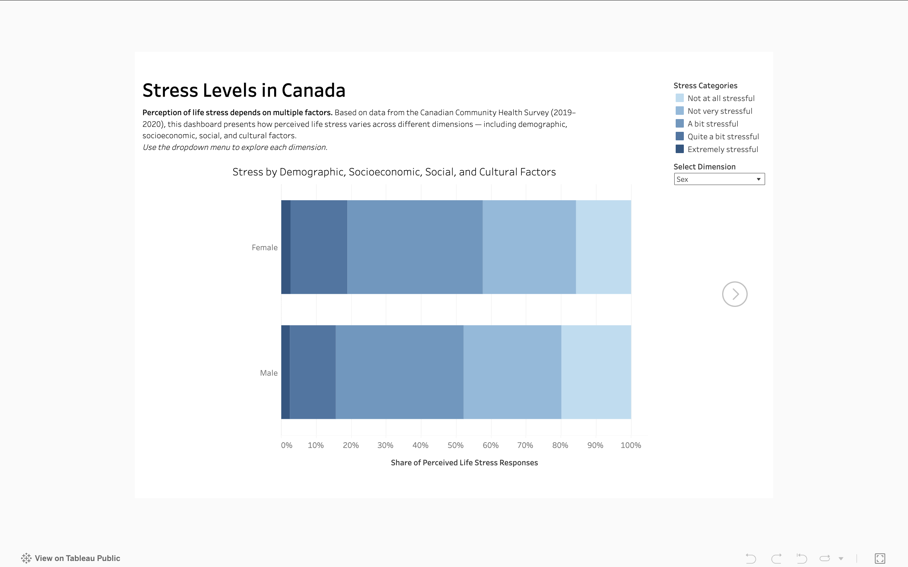
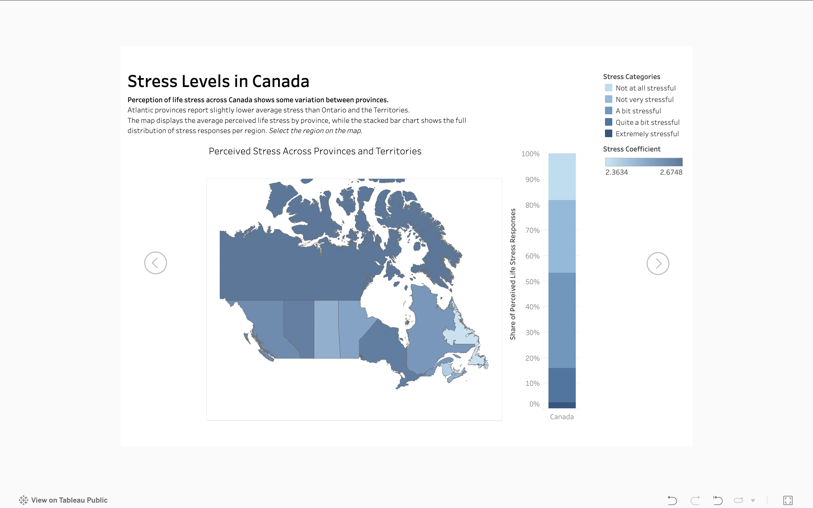

# Stress Levels in Canada

This project investigates the relationship between social factors, stress levels, and mental health across Canada. Using data from a complex national survey, it focuses on a selected set of features and applies exploratory data analysis (EDA), statistical methods, and data visualization. The main goal is to provide an overall picture of stress determinants and explore how stress may influence mental health. This work can serve as a foundation for more in-depth or targeted analyses.

## Project Versions

- **Version 1 (2019–2020)** focuses on exploratory data analysis of stress and its social determinants across provinces and territories, combining EDA, basic modeling, and Tableau dashboards.
- **Version 2 (2022)** is a follow-up project centered on **geospatial analysis**, examining perceived health, mental health, and life stress at the level of **grouped Health Regions**, with an emphasis on visual and geographic comparison rather than statistical modeling.

---

## Project Structure

### 1. Exploratory Data Analysis (Version 1)
- Cleaning and filtering data from the Canadian Community Health Survey (CCHS)
- Visual and statistical analysis of perceived stress across demographic, socioeconomic, social, and cultural dimensions
- Simple predictive models assessing how stress levels relate to mental health outcomes
- [Stress Levels.ipynb](Stress Levels.ipynb)

### 2. Geospatial Analysis (Version 2)
- Health-region–level mapping of perceived health, mental health, and life stress using CCHS 2022 data
- Integration of survey data with Statistics Canada health region boundary files
- Visual, comparative analysis without advanced statistical modeling
- [Stress Levels – Geospatial (v2).ipynb](Stress_Levels_Geospatial_v2.ipynb)

### 2. Tableau Dashboards
- Interactive dashboards summarizing key patterns for Version 1 and 2
- [View Version 1 on Tableau Public](https://public.tableau.com/shared/YBCP553YY?:display_count=n&:origin=viz_share_link)
- [View Version 2 on Tableau Public](https://public.tableau.com/shared/YBCP553YY?:display_count=n&:origin=viz_share_link)

  
   

---

## Data Sources

### Version 1 (2019–2020)
The first version of the analysis is based on the **Canadian Community Health Survey, 2019–2020: Annual Component**, conducted by Statistics Canada. This national survey provides detailed insight into health and social well-being across the population. The public-use microdata was released in June 2024 and is used here solely for educational and research purposes.

[Data Access – Statistics Canada](https://www150.statcan.gc.ca/n1/pub/82m0013x/82m0013x2024001-eng.htm)  
[Study Documentation – Borealis Repository](https://borealisdata.ca/dataset.xhtml?persistentId=doi:10.5683/SP3/ZVCGBK) *(Metadata → Export Metadata tab)*

*Adapted from Statistics Canada, Canadian Community Health Survey: Public Use Microdata File, 2019/2020, June 23, 2025. This does not constitute an endorsement by Statistics Canada of this product.*

---

### Version 2 (2022)
The second version of the project uses data from the **Canadian Community Health Survey, 2022**, focusing on geographic patterns of stress and perceived health at the level of grouped Health Regions. The data is part of the **Canadian Community Health Survey: Public Use Microdata File, 2019 to 2022**, published in June 2024 and updated in September 2025, and is used here for educational and research purposes.

[Data Access – Statistics Canada](https://www150.statcan.gc.ca/n1/pub/82m0013x/82m0013x2024001-eng.htm)  
[Study Documentation – Borealis Repository](https://abacus.library.ubc.ca/dataset.xhtml?persistentId=hdl:11272.1/AB2/QIKXXT) *(Metadata → Export Metadata tab)*

*Adapted from Statistics Canada, Canadian Community Health Survey: Public Use Microdata File, 2019 to 2022, December 9, 2025. This does not constitute an endorsement by Statistics Canada of this product.*

#### Geospatial Data (Version 2)
Geographic boundaries are based on the **Health Regions: Boundaries and Correspondence with Census Geography, December 2022** shapefile, released March 1, 2023, by Statistics Canada.

[Health region boundary files – Statistics Canada](https://www150.statcan.gc.ca/n1/pub/82-402-x/2023001/hrbf-flrs-eng.htm)

*Adapted from Statistics Canada, Health Regions: Boundaries and Correspondence with Census Geography, December 2022, December 9, 2025. This does not constitute an endorsement by Statistics Canada of this product.*

---

## Tools & Technologies

- **Python**: pandas, NumPy, matplotlib, seaborn, scipy, statsmodels
- **Data Source**: Canadian Community Health Survey (CCHS) 2019–2020
- **Visualization**: Tableau Public
- **Development**: QGIS, Jupyter Notebook

---

## Author

**Aleksej Talstou**  
Aspiring Data Scientist  
[LinkedIn →](https://www.linkedin.com/in/aliaxey-talstou)
