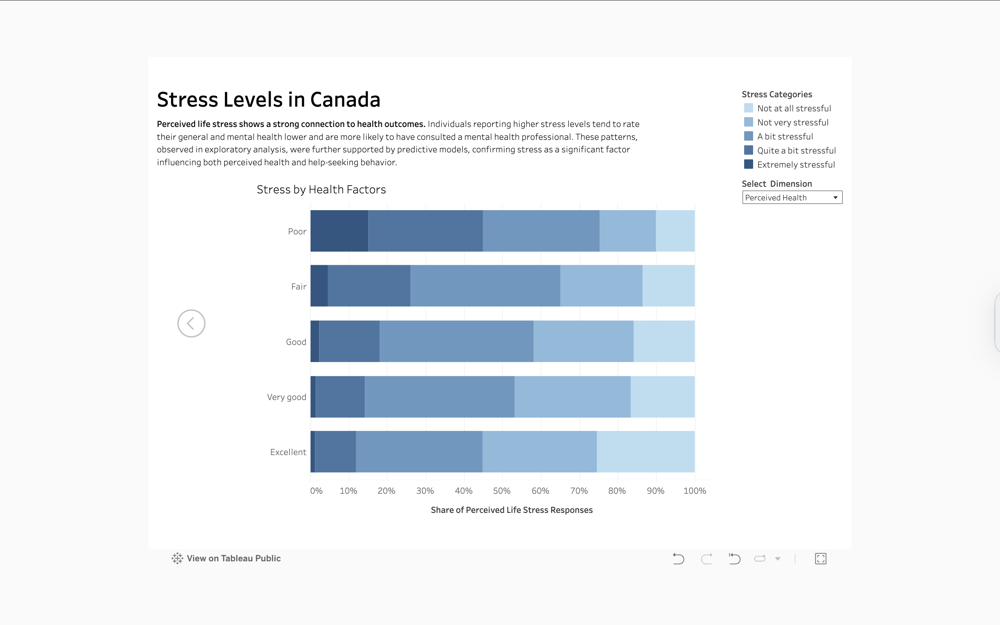

# Stress Levels in Canada

This project investigates the relationship between social factors, stress levels, and mental health across Canada. Using data from a complex national survey, it focuses on a selected set of features and applies exploratory data analysis (EDA), statistical methods, and data visualization. The main goal is to provide an overall picture of stress determinants and explore how stress may influence mental health. This work can serve as a foundation for more in-depth or targeted analyses.

---

## Project Structure

### 1. Exploratory Data Analysis (EDA)
- Cleaning and filtering data from the Canadian Community Health Survey (CCHS)
- Visual and statistical analysis of perceived stress across demographic, socioeconomic, social, and cultural dimensions
- Simple predictive models assessing how stress levels relate to mental health outcomes
- [Stress Levels.ipynb](Stress Levels.ipynb)

### 2. Tableau Dashboards
- Interactive dashboards summarizing key patterns  
- [View on Tableau Public](https://public.tableau.com/shared/YBCP553YY?:display_count=n&:origin=viz_share_link)

  
  
  

---

## Data Source

The analysis is based on the **Canadian Community Health Survey, 2019–2020: Annual Component**, conducted by Statistics Canada. This national survey provides detailed insight into health and social well-being across the population. The public-use microdata was released in June 2024 and is used here solely for educational and research purposes.

[Data Access – Statistics Canada](https://www150.statcan.gc.ca/n1/pub/82m0013x/82m0013x2024001-eng.htm)  
[Study Documentation – Borealis Repository](https://borealisdata.ca/dataset.xhtml?persistentId=doi:10.5683/SP3/ZVCGBK) *(Metadata → Export Metadata tab)*

*Adapted from Statistics Canada, Canadian Community Health Survey: Public Use Microdata File, 2019/2020, June 23, 2025. This does not constitute an endorsement by Statistics Canada of this product.*

---

## Tools & Technologies

- **Python**: pandas, NumPy, matplotlib, seaborn, scipy, statsmodels
- **Data Source**: Canadian Community Health Survey (CCHS) 2019–2020
- **Visualization**: Tableau Public
- **Development**: Jupyter Notebook

---

## Author

**Aleksej Talstou**  
Aspiring Data Scientist  
[LinkedIn →](https://www.linkedin.com/in/aliaxey-talstou)
